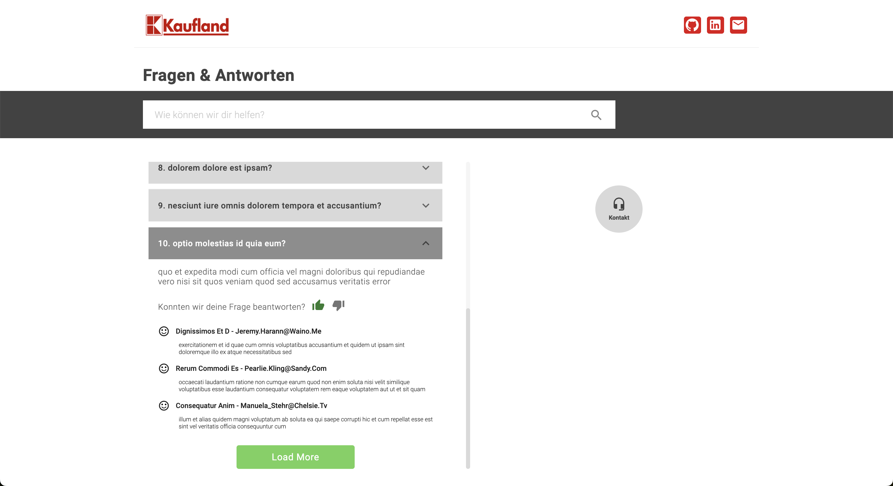
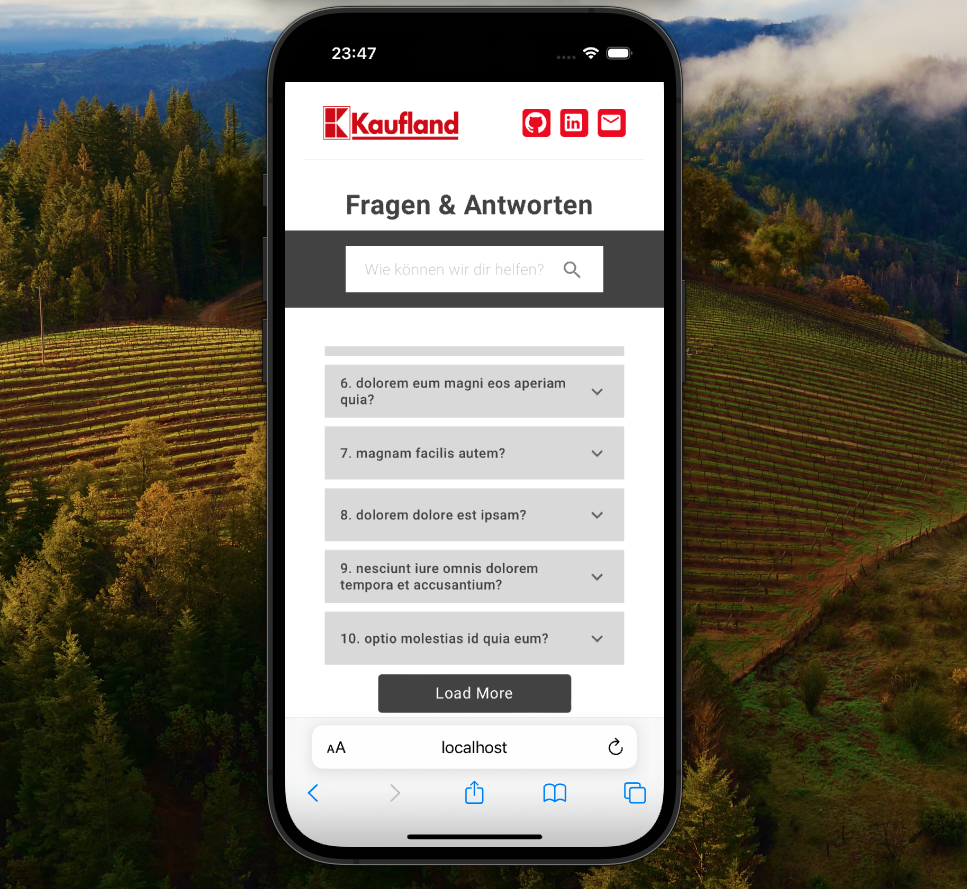

# FAQ page project

## Running The Project:

-   For running the project make sure you have npm@10.1.0 and node@20^ installed
-   The app will be available at http://localhost:3000/ after executing the following command:

```
npm start
```

## General Description:

-   Design inspiration was taken directly from Kaufland.de - [fragen-zur-bestellung](https://www.kaufland.de/help/marketplace/fragen-zur-bestellung/)
-   Initially, the page displays 10 questions, with an option to load 10 more by clicking the 'Load More' button
-   Every answer can be viewed by clicking on the question
-   User can Like or Dislike an answer, the reaction will be saved on browser cache
-   Every answer includes 3 comments
-   Users can use the search box to perform a search to find a specific question from the loaded ones
-   Users can load a maximum of 100 questions onto the page
-   Users can click on 'Kontakt' for additional support options
-   The page is responsive and can be viewed on both desktop and mobile devices




## Tech stack:

-   React (typescript)
-   Material UI
-   Unit testing with React Testing Library
